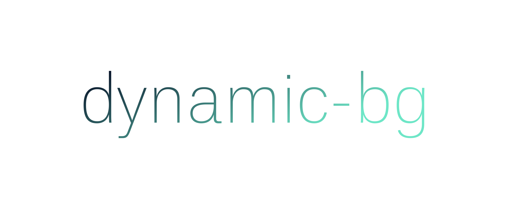
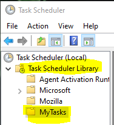
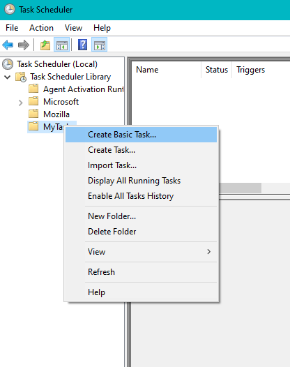
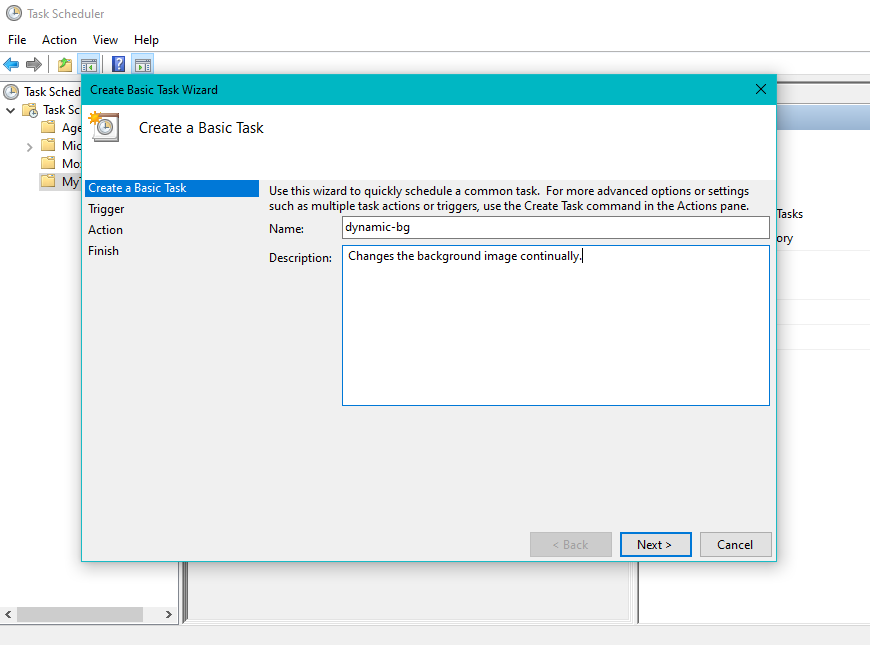
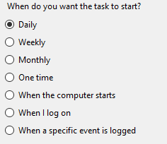
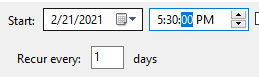
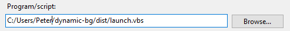

[![Contributors][contributors-shield]][contributors-url]
[![Forks][forks-shield]][forks-url]
[![Stargazers][stars-shield]][stars-url]
[![Issues][issues-shield]][issues-url]
[![MIT License][license-shield]][license-url]


<!-- PROJECT LOGO -->
<br />
<p align="center">
  <a href="https://github.com/WhateverHappns/dynamic-bg">
    
  </a>

  <h3 align="center">dynamic-bg</h3>

  <p align="center">
    Automatically change your Windows background image to a random HQ photo.
    <br />
    <a href="https://github.com/WhateverHappns/dynamic-bg"><strong>Explore the docs »</strong></a>
    <br />
    <br />
    <a href="https://github.com/WhateverHappns/dynamic-bg">View Demo</a>
    ·
    <a href="https://github.com/WhateverHappns/dynamic-bg/issues">Report Bug</a>
    ·
    <a href="https://github.com/WhateverHappns/dynamic-bg/issues">Request Feature</a>
  </p>
</p>


<!-- TABLE OF CONTENTS -->
<details open="open">
  <summary><h2 style="display: inline-block">Table of Contents</h2></summary>
  <ol>
    <li>
      <a href="#about-the-project">About The Project</a>
      <ul>
        <li><a href="#built-with">Built With</a></li>
      </ul>
    </li>
    <li>
      <a href="#getting-started">Getting Started</a>
      <ul>
        <li><a href="#prerequisites">Prerequisites</a></li>
        <li><a href="#installation">Installation</a></li>
      </ul>
    </li>
    <li><a href="#usage">Usage</a></li>
    <li><a href="#roadmap">Roadmap</a></li>
    <li><a href="#contributing">Contributing</a></li>
    <li><a href="#license">License</a></li>
    <li><a href="#contact">Contact</a></li>
    <li><a href="#acknowledgements">Acknowledgements</a></li>
  </ol>
</details>


<!-- ABOUT THE PROJECT -->
## About The Project


<!--
Here's a blank template to get started:
**To avoid retyping too much info. Do a search and replace with your text editor for the following:**
`WhateverHappns`, `dynamic-db`, `twitter_handle`, `email`, `project_title`, `project_description`
-->


### Built With

* [Python](https://www.python.org)
* [Unsplash](https://unsplash.com)


<!-- GETTING STARTED -->
## Getting Started

To get a local copy up and running follow these simple steps.

### Prerequisites

Note that you only need these prerequisites if you want to use the ".py" version. You may use the ".exe" as well as the Batch and VBScript without having to install these dependencies.
Dynamic-bg depends on [Pandas](https://pypi.org/project/pandas/) to open the ".csv" file located in the "unsplash" directory.
* pip 
  ```sh
  pip install pandas
  ```

### Installation

Clone the repository into your Windows USERPROFILE path. (e.g. "C:/Users/Peter")

1. Clone the repo
   ```sh
   git clone https://github.com/WhateverHappns/dynamic-bg.git
   ```
2. Open "Task Scheduler" from the Windows Menu

3. Right click the folder "Task Scheduler Library" and create a new folder called "MyTasks" (or anything else)

   

4. Right click on the newly created folder and click "Create Basic Task"

   

5. Give the task a name and (optionally) a description

   

6. Next, click "Daily" and change the time to anything you want. This will be the time when the task gets executed

    

7. Open the "Browse" folder to locate the path to the dynamic-bg/dist/launcher.vbs file. Ideally, this should be in your user folder like so:

   

8. Click Finish.


<!-- USAGE EXAMPLES
## Usage

Use this space to show useful examples of how a project can be used. Additional screenshots, code examples and demos work well in this space. You may also link to more resources.

_For more examples, please refer to the [Documentation](https://example.com)_
-->


<!-- ROADMAP -->
## Roadmap

See the [open issues](https://github.com/WhateverHappns/dynamic-bg/issues) for a list of proposed features (and known issues).


<!-- CONTRIBUTING -->
## Contributing

1. Fork the Project
2. Create your Feature Branch (`git checkout -b feature/AmazingFeature`)
3. Commit your Changes (`git commit -m 'Add some AmazingFeature'`)
4. Push to the Branch (`git push origin feature/AmazingFeature`)
5. Open a Pull Request


<!-- LICENSE -->
## License

Distributed under the MIT License. See `LICENSE` for more information.


<!-- MARKDOWN LINKS & IMAGES -->
<!-- https://www.markdownguide.org/basic-syntax/#reference-style-links -->
[contributors-shield]: https://img.shields.io/github/contributors/WhateverHappns/dynamic-bg.svg?style=for-the-badge
[contributors-url]: https://github.com/WhateverHappns/dynamic-bg/graphs/contributors
[forks-shield]: https://img.shields.io/github/forks/WhateverHappns/dynamic-bg.svg?style=for-the-badge
[forks-url]: https://github.com/WhateverHappns/dynamic-bg/network/members
[stars-shield]: https://img.shields.io/github/stars/WhateverHappns/dynamic-bg.svg?style=for-the-badge
[stars-url]: https://github.com/WhateverHappns/dynamic-bg/stargazers
[issues-shield]: https://img.shields.io/github/issues/WhateverHappns/repo.svg?style=for-the-badge
[issues-url]: https://github.com/WhateverHappns/dynamic-bg/issues
[license-shield]: https://img.shields.io/github/license/WhateverHappns/dynamic-bg.svg?style=for-the-badge
[license-url]: https://github.com/WhateverHappns/dynamic-bg/blob/master/LICENSE
